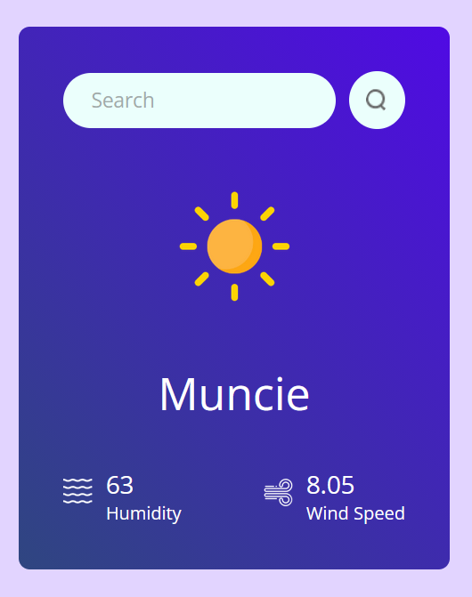
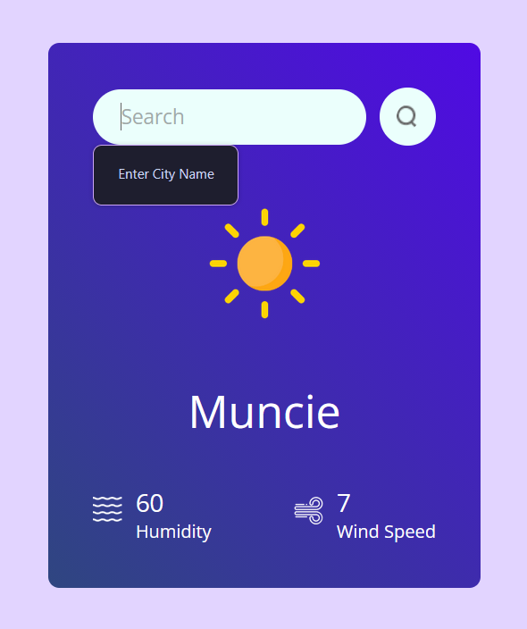
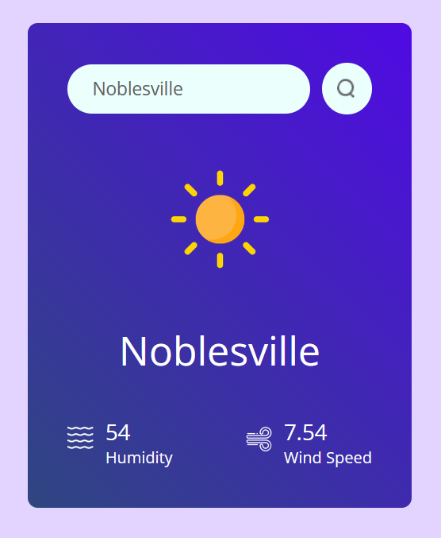

<header>
    <h1 role="title">Weather App</h1>
    <h6 role="subtitle">Kat R. | CS 311.2 - Web and Mobile Development</h6>
</header>

<main>
    <section>
        

            This is a work that took place over multiple class periods. 
            It utilizes some of the key features of <kbd>React</kbd> such as 
            <code>useState()</code>, <code>useEffect()</code>, and <code>useRef()</code>; 
            asynchronous fetch calls; and in my case, 
            a lot of hard truths about changing from 
            <kbd>JavaScript</kbd> to <kbd>TypeScript</kbd>.
        

        

            For some reason I decided to port the weather app from <code>.jsx</code> to <code>.tsx</code> by hand.
            Even though I've never used <kbd>React-ts</kbd> let alone regular <kbd>TypeScript</kbd>.
            It was really hard, but also incredibly informative.
            Please excuse the <code>// @ts-ignore</code> here and the <code>// @ts-expect-error</code> there.
        

        

            
                <i>
                    (Except for the instance of <code>useRef()</code>.
                    That one already has a valid excuse.)
                </i>
            
        

    </section>
    <section>
        <h1>Here's what it looks like!</h2>
        <h3>Default Appearance</h3>
        
        <h3>Search Bar Demo</h3>
        
        
        
    </section>
</main>
